# Tactiek

Tactische aspecten van het beheer van de Digikoppeling standaard omvatten
de open invulling, samenhang met andere standaarden, het stimuleren 
van het gebruik van de standaard en tot slot het kwaliteitsbeleid.

## Community
Veel verschillende partijen hebben direct dan wel indirect belang bij
de ontwikkeling, de implementatie en het gebruik van de
Digikoppeling-standaard. Dit geldt dus ook voor het beheer en
onderhoud ervan. In onderstaand schema zijn de belanghebbenden
aangegeven.

```mermaid
mindmap
  root)Belang bij<br>Digikoppeling(
    {{Vraag}}
      (Sectorregiseurs)
        VNG
        DUO
        BKWI
      (Gebruikers)
        Indivduele overheden
        Sectoren
        Bronhouders van basisregistraties
      (eOverheids projecten)
        MijnOverheid
        eHerkenning
        eID
    {{Ondersteuning}}
      (Expertise)
        Adviesbureaus
        ICT–experts
      (Beheer en onderhoud)
        Domeinexpert
        Logius
    {{Aanbod}}
      (Standaardisatie organisaties)
        OASIS
        W3C
        NIST
        Forum Standaardisatie
        Europese Commissie
      (Leveranciers)
        Diensten
        Producten
```

<figure>
<figcaption>Belang bij Digikoppeling</figcaption>
</figure>
		

De Digikoppeling standaard wordt in stand gehouden en doorontwikkeld
door participatie van de belanghebbenden. Ruwweg zijn drie rollen te
onderkennen, de vraagkant, de aanbodkant en de ondersteuningskant:
* De vraagkant bestaat uit organisaties die Digikoppeling koppelingen
  gebruiken voor de eigen informatievoorziening, sectoren die
  Digikoppeling gebruiken als standaard voor
  (keten)integratiedoeleinden en e-overheidsprojecten die
  Digikoppeling toepassen.
* De aanbodkant bestaat uit ICT leveranciers die de producten maken
  voor ondersteuning van de open standaarden waarop Digikoppeling is
  gebaseerd (adapter-leveranciers of diensten-leveranciers). Onder de
  aanbodkant rekenen we ook standaardisatie-organisaties (OASIS, W3C
  e.d.) waar de standaarden waarop Digikoppeling is gebaseerd vandaan
  komen.
* De ondersteuningskant bestaat uit de beheerders van de
  Digikoppeling-standaarden en beheerders van de
  Digikoppeling-voorzieningen. Expertise voor Digikoppeling is ook
  verkrijgbaar in de markt.

Afhankelijk van eigen doelstellingen, verantwoordelijkheden en
belangen zullen belanghebbenden op een andere wijze participeren.

## Architectuur
De Nederlandse Overheid Referentie Architectuur (NORA) positioneert
Digikoppeling als de logistieke laag voor standaardisatie van
communicatie tussen systemen bij overheidsorganisatie op basis van
webservice standaarden.

De NORA maakt geen deel uit van het in dit document beschreven
beheer van de Digikoppeling-standaard, maar bevat wel belangrijke
informatie over Digikoppeling en haar toepassing.

De MIDO governance kent een [Architectuurraad](#architectuurraad).
Dit gremium kan om advies worden gevraagd over wijzigingsvoorstellen.

De Digikoppeling architectuur is beschreven in een apart document [[Digikoppeling-Architectuur]].

### Internationale, Europese en nationale standaardisatiegemeenschap
Internationale standaarden leveren de basis voor de koppelvlakspecificaties
die we in Digikoppeling gebruiken.

1. Digikoppeling volgt de ontwikkeling van internationale standaarden,
   beheerd door organisaties als **W3C** en **OASIS**. Deze organisaties
   beheren basisstandaarden als WUS, ebMS [[EBXML-MSG]] en HTTP [[rfc1945]].

2. In EU kader wordt de
   [eDelivery](https://ec.europa.eu/digital-building-blocks/wikis/display/DIGITAL/eDelivery)
   standaard beheerd. eDelivery is in functionaliteit vergelijkbaar met
   Digikoppeling. eDelivery is net als Digikoppeling gebaseerd op ebMS. Hoewel
   eDelivery gebaseerd is op de nieuwere ebMS3/AS4 standaard.

<aside class="note" title="Het 4 corner model">
De scope van de eDelivery is vergelijkbaar met die van Digikoppeling,
maar dan specifiek voor internationaal berichtenverkeer tussen
EU lidstaten. In de praktijk wordt hier het _four corner model_ toegepast.
Per lidstaat is een gateway beschikbaar waarmee in een nationale standaard
(zoals Digikoppeling) berichten uitgewisseld kunnen worden. Deze gateway
stuurt het dan volgens eDelivery door naar een organisatie in een andere
lidstaat of naar een gateway in een lidstaat, die het vervolgens doorstuurt
naar die overheid. Organisaties in verschillende lidstaten hebben natuurlijk
de mogelijkheid om direct berichten uit te wisselen zonder gebruik te maken
van het four corner model. 
</aside>

### Samenwerking met andere beheerorganisaties
Digikoppeling sluit aan op onderstaande standaarden. De aansluiting
vindt plaats binnen de vastgestelde releasetermijnen van de
Digikoppeling onderdelen.

1. Basisstandaarden als WUS, ebMS en HTTP. Deze worden beheerd door
   standaardisatieorganisaties als **OASIS** en **W3C** (zie boven).

2. Koppelvlakstandaarden worden waar mogelijk geharmoniseerd met internationale 
   (EU) standaarden. Hiervoor volgen we onder meer de standaarden en bouwstenen 
   van EU DIGIT.

3. De Digikoppeling-standaard volgt de Nederlandse Overheid Referentie
   Architectuur (NORA).

4. De Digikoppeling-standaard en in het bijzonder "Gebruik en
   achtergrond Digikoppeling-certificaten" sluiten aan bij de
   PKI.Overheid.

5. Logius deelt ervaringen met het beheer van standaarden zoals Digikoppeling
   met andere standaardenorganisaties binnen het BOMOS _Klankbordoverleg_.

## Rechtenbeleid
Dit werk is gelicenseerd onder een Creative Commons Naamsvermelding 4.0
Unported licentie.

Meer informatie over de precieze voorwaarden van deze licentie vindt u
op de website van Creative Commons http://creativecommons.nl/ en
specifiek voor deze licentie een samenvatting onder
http://creativecommons.org/licenses/by/4.0/deed.nl en de volledige
licentietekst onder
http://creativecommons.org/licenses/by/4.0/legalcode.

Dit werk en de specificaties van de Digikoppeling-standaard worden
royalty free ter beschikking gesteld. Organisaties en personen die
bijdragen aan Digikoppeling dienen hun bijdragen vrij te geven zodanig
dat hieraan voldaan kan worden. Door bij te dragen aan Digikoppeling
verklaren zij hiermee in te stemmen.

Uitgesloten van alle bovenstaande zijn rechten verbonden aan de
standaarden, profielen en andere onderdelen waar Digikoppeling gebruik
van maakt. Hierop zijn de rechten van de betreffende standaarden,
profielen en andere onderdelen zelf van toepassing.

## Kwaliteitsbeleid en benchmarking
Zoals gezegd wordt het beheer van de Digikoppeling standaard volledig
open ingevuld (zie ook de paragraaf [BOMOS](#bomos) en
[Governance](#governance)) Dit borgt dat zoveel
mogelijk belangstellenden en belanghebbenden betrokken zijn bij
wijzigingen en besluitvorming rond die wijzigingen.

## Adoptie en erkenning
De Digikoppeling standaard heeft de 'pas toe of leg uit' -status van Forum
Standaardisatie. Dit betekent kort gezegd dat Nederlandse
overheidspartijen en partijen uit de (semi) publieke sector deze
standaard dienen toe te passen op het moment dat zij hun informatie
met behulp van Digikoppeling standaard willen ontsluiten voor andere overheidspartijen.
Zie [sectie over visie in de strategie](#visie) voor meer informatie.
